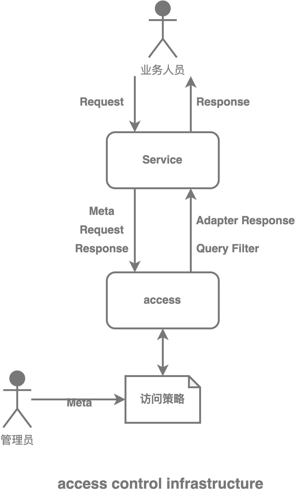

### Access 访问控制
[](http://devtoolgroup.github.io)


access 是一个基于Java开发的动态访问控制组件，通过 **元数据+规则** 的方式配置实现复杂的操作权限控制、数据访问控制以及数据内容控制，在涉及动态数据的访问控制时，相较于传统的RBAC访问控制，不需求额外的定制开发，只需要开发组织好**元数据**，即可通过动态配置满足访问控制的要求。

### 简要说明
#### 许可证
    GPL 3.0

#### Java版本
    Java 8+
#### 架构图


#### 功能特点
access 主要功能特点如下：
- 操作权限控制
- 数据权限控制，包括数据范围，数据内容

### 快速开始
当前workflow处于SNAPSHOT版本，可直接clone代码，本地构建打包使用，遇到问题可以进入[官网](http://devtoolgroup.github.io)加入交流群。
> 当前建议使用前充分验证，

如果觉得还可以麻烦给个star以示认可，非常感谢🙏🙏🙏。


### 使用示例
```yaml
key: "access"
privileges:
  - condition: "\"@(/age)\" > 5 && \"@(/gender)\" == \"F\""
  - condition: "\"@(/age)\" > 10 && \"@(/gender)\" == \"F\""
scopes:
  - condition: "\"@(/age)\" > 5 && \"@(/gender)\" == \"F\""
    where:
      op: "GE"
      entity: "user"
      column: "age"
      parameters:
        - 5
  - condition: "\"@(/age)\" < 5 && \"@(/gender)\" == \"F\""
    where:
      op: "GE"
      entity: "user"
      column: "age"
      parameters:
        - 5
fields:
  - condition: "\"@(/age)\" > 5 && \"@(/gender)\" == \"F\""
    paths:
      - "/married"
  - condition: "\"@(/age)\" > 10 && \"@(/gender)\" == \"F\""
    paths:
```
具体使用使用可以参考以下代码
> src/main/java/group/devtool/access/documentation/ExampleAccessControlService.java

### 沟通交流
[***交流地址***](http://devtoolgroup.github.io)

如果你也是一名热爱代码的朋友，非常非常欢迎你的加入一起讨论学习，作者也是一名热爱代码的小白，期待你的加入。

### 后续迭代
重点任务：
1. 规则表达式支持更多函数
2. 前端页面设计
3. 缺陷修复
